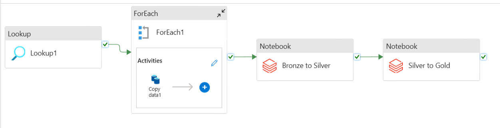

# Azure Data Engineering Project: Customer & Sales Insights Pipeline

## Project Overview
This project demonstrates a complete end-to-end data engineering pipeline built on Azure Cloud. It extracts customer and sales data from an on-premises SQL Server database, transforms it using cloud-based services, and delivers insights via  dashboard. The solution is designed to help analyze gender distribution and product purchasing patterns.

---

## Business Requirements

- Extract customer and sales data from an on-premises SQL Server database  
- Store raw data in a data lake for traceability and historical reference  
- Clean and transform data for business analysis  
- Generate insights into:  
  - Gender distribution among customers  
  - Product category performance segmented by gender  
- Build an interactive dashboard for stakeholders with filtering capabilities  

---

## Technology Stack

- **Azure Data Factory**: Data ingestion and pipeline orchestration  
- **Azure Data Lake Storage Gen2**: Raw (bronze), cleansed (silver), and business-ready (gold) data storage  
- **Azure Databricks**: Data transformation using Apache Spark  
- **Azure Synapse Analytics**: Data modeling and SQL querying  
- **Tableau**: Dashboard creation and interactive data visualization  
- **Azure Key Vault**: Secure secrets and credentials management  
- **Microsoft Entra ID**: Identity and role-based access control  
- **SQL Server (On-Premises)**: Source database (AdventureWorksLT2022)  

---

## Dataset

This project uses data from the **AdventureWorksLT2022** sample database, containing:

- **Customers**: Personal and demographic details  
- **Sales Orders**: Product purchase history  
- **Products & Categories**: Product metadata for classification  
- **Address & Location**: Customer geography and regional patterns  

---

## Implementation Steps

### 1. Azure Environment Setup

- Create a resource group for all services  
- Set up Azure Data Lake Storage Gen2 with hierarchical namespace  
  - Containers: `bronze`, `silver`, `gold`  
- Create and configure:
  - Azure Data Factory instance  
  - Azure Databricks workspace  
  - Azure Synapse Analytics workspace  
  - Azure Key Vault for storing SQL credentials securely  

---

### 2. Data Ingestion with Azure Data Factory

- Connect to the on-premises SQL Server using a **self-hosted integration runtime**  
- Build a Data Factory pipeline to:
  - Use **Lookup** and **ForEach** activities to dynamically identify and ingest tables  
  - Copy data from SQL Server into the **bronze** container in ADLS  
  - Validate data transfer and schema accuracy  

---

### 3. Data Transformation with Azure Databricks

- Mount the Data Lake to Databricks for seamless access  
#### Silver Layer: Cleansing and Standardization
- **Reads**: Raw data from the Bronze layer.
- **Cleansing**: Enforces consistent data types, skips decimals, and formats dates (`yyyy-MM-dd`).
- **Deduplication**: Removes duplicates using primary keys and `ModifiedDate`.
- **Writes**: Cleansed data to the Silver layer in Delta format.

#### Gold Layer: Business-Ready Modeling
- **Reads**: Data from the Silver layer.
- **Renaming**: Converts columns from camelCase/PascalCase to snake_case.
- **Prepares**: Final analytics-ready tables for reporting.
- **Writes**: Optimized, structured data to the Gold layer.

---

### 4. Data Analysis with Synapse Analytics

- Connect Synapse to the **Gold layer** in the Data Lake  
- Create **external tables and views** for fast query access  
- Run SQL scripts to support visualizations:  
  - Total sales and revenue  
  - Product category breakdown by gender  
  - Trends over time  

---

## Security & Governance

- **Azure Key Vault**: Manages secrets like SQL login credentials securely  
- **Microsoft Entra ID (Azure AD)**: Role-based access control and least privilege principles applied  

---
